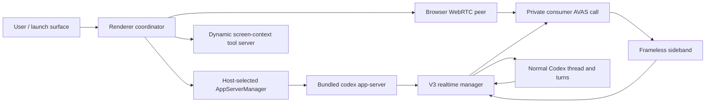

# Current Codex Real Time Voice Architecture
**Version 1.0.0** · Current desktop evidence: 26.721.31836/build 5828

---

## AI READING INSTRUCTION

Read `[SPEC]` for the traced architecture. Read `[NOTE]` for interpretation. Treat `[?]` as unresolved. Never infer build-5828 behavior from the discarded build-5813 observation or silently substitute the newer alpha.6 source for the bundled alpha.3.1 binary.

---

## 1. Ownership map

**[SPEC]**

- Electron main owns the bundled Codex executable, app-server connection, cross-window session reservation, hotkey/overlay coordination, and durable realtime observation. It is a privileged broker, not the microphone/WebRTC media endpoint. [APP-5828: `Contents/Resources/app.asar/.vite/build/main-D9i1FeCI.js:8,305-307,1273-1274`]
- The renderer owns the `RTCPeerConnection`, microphone input stream, remote output stream/playback, output-level analysis, realtime UI, and the `oai-events` data channel. [APP-5828: `Contents/Resources/app.asar/webview/assets/app-initial-C-fROkKo.js:749,777-894`; Codex A6: `~/.codex/codex/codex-rs/app-server/README.md:903-940`]
- Codex app-server/core owns authentication, consumer call creation, V3 session construction, sideband join, event parsing, thread/turn association, delegation, and app-server notification translation. [Codex A3.1: `codex-rs/core/src/realtime_conversation.rs:1113-1197,1271-1320`; `codex-rs/app-server/src/bespoke_event_handling.rs:393-412`; Codex A6: `~/.codex/codex/codex-rs/core/src/realtime_conversation.rs:506-630,1377-1506,1665-1825`]

## 2. Launch and reservation barrier

**[SPEC]**
1. The launch surface reads optimistic launch state and presents starting, failed, retry, and back states. It waits for both connection and presentation handoff before leaving the launch surface. [APP-5828: `webview/assets/realtime-voice-launch-surface-C9glm7ls.js:1`]
2. The stage layout completes the visual handoff on the first animation frame after `isConnecting` becomes false; the handoff-target asset owns the presentation-anchor animation. [APP-5828: `webview/assets/realtime-voice-stage-layout-CjclUtP9.js:1`; `webview/assets/realtime-voice-handoff-target-Dyx7hOYI.js`, static asset evidence]
3. Electron main reserves the realtime session across windows/hosts and resets that reservation when the overlay or application lifecycle closes. [APP-5828: `.vite/build/main-D9i1FeCI.js:1273-1274`]
4. The renderer coordinator obtains an `AppServerManager` for the chosen host and claims the cross-window/host session before preparing WebRTC. [APP-5828: `webview/assets/app-initial-C-fROkKo.js:894`, byte-derived coordinator segment retained only as an evidence description]
5. Runtime activation is a four-condition barrier: start request accepted, `thread/realtime/started` observed, WebRTC connected, and realtime session initialized. Only then does `starting` become `active`; active begins in `listening`, plays the start sound, enables the voice bridge, and arms inactivity termination. [APP-5828: `webview/assets/app-initial-C-fROkKo.js:894`, coordinator `rrs`/runtime `fns` evidence]

**[NOTE]**
The visual handoff barrier and the runtime activation barrier are related but not identical. The former protects presentation continuity; the latter prevents a half-started call from appearing active.

## 3. App-server and thread initialization

**[SPEC]**
- The desktop resolves the packaged executable at `Contents/Resources/codex` unless `CODEX_CLI_PATH` overrides it, then connects to app-server. [APP-5828: `.vite/build/main-D9i1FeCI.js:8`]
- App-server stdio is newline-delimited JSON with JSON-RPC 2.0's `jsonrpc` member omitted. A connection sends one `initialize`, then `initialized`; experimental realtime requires `initialize.params.capabilities.experimentalApi: true`. [Codex A6: `~/.codex/codex/codex-rs/app-server/README.md:20-29,77-89,2322-2346`]
- The coordinator starts a normal Codex thread with realtime-specific thread source/kind, dynamic tools, base/developer instructions, and optional model/reasoning settings. Voice work therefore remains attached to ordinary `thread/*`, `turn/*`, approvals, tools, and rollout state. [APP-5828: `webview/assets/app-initial-C-fROkKo.js:777-894`; `.vite/build/main-D9i1FeCI.js:305-307`]
- The renderer creates the WebRTC offer and sends it through `thread/realtime/start` with `transport: {type: "webrtc", sdp}`, audio output, and the thread ID. App-server immediately returns `{}`; the answer arrives asynchronously as `thread/realtime/sdp`. [Codex A6: `~/.codex/codex/codex-rs/app-server/README.md:903-950`; `~/.codex/codex/codex-rs/app-server-protocol/src/protocol/v2/realtime.rs:65-154,283-290`]
- `thread/realtime/start` is feature-gated on the loaded thread, maps the app-server request to `Op::RealtimeConversationStart`, and carries handoff flags, initial items, prompt, session ID, transport, version, and voice into core. [Codex A6: `~/.codex/codex/codex-rs/app-server/src/request_processors/turn_processor.rs:1029-1113`]

## 4. Media and WebRTC streams

**[SPEC]**
- The renderer requires both `navigator.mediaDevices.getUserMedia` and `RTCPeerConnection`. It acquires the microphone, exposes distinct input/output `MediaStream`s, and selects an effective voice slug before starting the WebRTC runtime. [APP-5828: `webview/assets/app-initial-C-fROkKo.js:777-894`; coordinator APIs `getStream` and `getOutputStream`]
- The peer adds microphone audio and creates the `oai-events` data channel before producing its SDP offer; the remote audio track is played by the renderer. [Codex A6: `~/.codex/codex/codex-rs/app-server/README.md:903-923`]
- The private call is created by authenticated Codex core. WebRTC carries media; core joins the accepted call through a sideband WebSocket and runs text input, agent handoff output, server events, and optional app-server-managed audio through a single realtime loop. [Codex A6: `~/.codex/codex/codex-rs/core/src/realtime_conversation.rs:571-620,1665-1825`]

## 5. App-server realtime RPC and notifications

**[SPEC]**

| Direction | Methods/events | Purpose | Source |
|---|---|---|---|
| Client request | `thread/realtime/start` | Start thread-scoped realtime | `~/.codex/codex/codex-rs/app-server/src/message_processor.rs:1295-1299` |
| Client request | `thread/realtime/appendAudio` | Append an app-server audio frame | `~/.codex/codex/codex-rs/app-server/src/message_processor.rs:1300-1304` |
| Client request | `thread/realtime/appendText` | Append role-bearing text | `~/.codex/codex/codex-rs/app-server/src/message_processor.rs:1305-1309` |
| Client request | `thread/realtime/appendSpeech` | Request speakable output | `~/.codex/codex/codex-rs/app-server/src/message_processor.rs:1310-1314` |
| Client request | `thread/realtime/stop` | Close the thread's realtime conversation | `~/.codex/codex/codex-rs/app-server/src/message_processor.rs:1315-1319` |
| Client request | `thread/realtime/listVoices` | Read built-in voice sets/defaults | `~/.codex/codex/codex-rs/app-server/src/message_processor.rs:1320-1322` |
| Server notification | `thread/realtime/started` | Thread, upstream realtime session, version | `~/.codex/codex/codex-rs/app-server-protocol/src/protocol/v2/realtime.rs:231-239` |
| Server notification | `thread/realtime/sdp` | Answer SDP | `~/.codex/codex/codex-rs/app-server-protocol/src/protocol/v2/realtime.rs:283-290` |
| Server notification | `thread/realtime/itemAdded` | Handoff/request and other raw items | `~/.codex/codex/codex-rs/app-server-protocol/src/protocol/v2/realtime.rs:241-248`; `~/.codex/codex/codex-rs/app-server/src/bespoke_event_handling.rs:509-536` |
| Server notification | `thread/realtime/transcript/delta`, `/done` | Role-tagged transcript state | `~/.codex/codex/codex-rs/app-server-protocol/src/protocol/v2/realtime.rs:250-272` |
| Server notification | `thread/realtime/outputAudio/delta` | Streamed audio when app-server owns audio transport | `~/.codex/codex/codex-rs/app-server-protocol/src/protocol/v2/realtime.rs:274-280` |
| Server notification | `thread/realtime/error`, `/closed` | Failure and terminal lifecycle | `~/.codex/codex/codex-rs/app-server-protocol/src/protocol/v2/realtime.rs:292-308` |

The installed renderer explicitly recognizes `started`, `outputAudio/delta`, transcript delta/done, `sdp`, `error`, and `closed`; the higher-level coordinator also reacts to ordinary `turn/started`, `turn/completed`, and `thread/archived`. [APP-5828: `webview/assets/app-initial-C-fROkKo.js:749,894`]

## 6. Transcript and speaking/listening state

**[SPEC]**
- Transcript deltas and completed text are keyed by thread and role; the renderer maintains current user/assistant transcript state from these notifications. [Codex A6: `~/.codex/codex/codex-rs/app-server-protocol/src/protocol/v2/realtime.rs:250-272`; APP-5828: `webview/assets/app-initial-C-fROkKo.js:894`]
- Output audio level drives presentation: crossing the speaking threshold enters `speaking`; sustained silence returns to `listening`. Input and output levels are independent. [APP-5828: `webview/assets/app-initial-C-fROkKo.js:777-894`]
- Microphone mute and output mute are separate host-synchronized controls. The coordinator can refresh the selected microphone without recreating the whole session. [APP-5828: coordinator APIs `refreshMicrophoneInput`, `toggleMute`, `toggleMicrophoneMute`, `getStream`, `getOutputStream` in `webview/assets/app-initial-C-fROkKo.js:777-894`]

## 7. Continuity and memory

**[SPEC]**
- Continuity is independently gated and bounded by item count 1–20 (default 10) and per-item text length 100–4000; memory summary has a separate gate and prompt. [APP-5828: `webview/assets/app-initial-C-fROkKo.js:777-894`, keys `realtime_continuity_*` and `realtime_memory_summary_*`]
- The coordinator loads continuity/memory before WebRTC start and supplies V3 initial context to the realtime runtime. Resumed context instructs the voice layer to remain silent until a new current-session user message arrives. [APP-5828: `webview/assets/app-initial-C-fROkKo.js:777-894`]
- V3 `initialItems` are complete role-bearing items delivered in the initial Frameless session payload; core enforces 128 items, at most 8,192 estimated tokens per item, and 8,192 total. V1/V2 reject non-empty initial items. [Codex A6: `~/.codex/codex/codex-rs/app-server-protocol/src/protocol/v2/realtime.rs:101-135`; `~/.codex/codex/codex-rs/core/src/realtime_conversation.rs:91-95,1246-1270`; `~/.codex/codex/codex-rs/codex-api/src/endpoint/realtime_websocket/methods_frameless_bidi.rs:45-88`]

## 8. Delegation and handoff

**[SPEC]**
- The voice prompt presents one unified assistant but chooses among conversing directly, doing a quick check directly, or delegating blocking mechanics to a worker Codex thread. User and backend text are distinguished by `[USER]` and `[BACKEND]` prefixes. [APP-5828: `webview/assets/app-initial-C-fROkKo.js:894`]
- Frameless `delegation.created` becomes a core `RealtimeHandoffRequested`; core routes its text into the normal Codex thread. Turn/tool work therefore occurs in the established agent/approval lifecycle, not in a second Electron agent loop. [Codex A6: `~/.codex/codex/codex-rs/codex-api/src/endpoint/realtime_websocket/protocol_frameless_bidi.rs:73-95`; `~/.codex/codex/codex-rs/core/src/realtime_conversation.rs:1451-1487`]
- Core streams ordinary Codex output back through Frameless delegation/session context. V3 supports `thinking`, `commentary`, and `bemTags` routing, response-as-item experiments, and `clientManagedHandoffs`; the installed main-process recorder correlates handoff IDs to ordinary `turn/started` and `turn/completed`. [Codex A6: `~/.codex/codex/codex-rs/app-server/README.md:977-1003`; `~/.codex/codex/codex-rs/core/src/realtime_conversation.rs:434-445,726-1022`; APP-5828: `.vite/build/main-D9i1FeCI.js:305-307`]

## 9. Screen-context tool server

**[SPEC]**
- The thread is started with dynamic tools, and desktop realtime can issue a screen-context server request routed to appshot capture. The capture returns screenshot and accessibility text, then the desktop sends a server response. [APP-5828: `webview/assets/app-initial-C-fROkKo.js:777-894`; RUN-5828: sanitized runtime log lines 1990-2001]
- This is a desktop-harness capability, not a model-transport primitive: renderer/main coordinate permission-sensitive capture and return only the tool result to the realtime request. [RUN-5828: sanitized runtime log lines 1990-2001]

## 10. Stop, inactivity, failure, and cleanup

**[SPEC]**
- User stop, startup cancellation, app unmount, thread archive, inactivity, usage limit, server error, SDP rejection, WebRTC failure, and unexpected close are distinct terminal causes; requested `transport_closed` is treated specially during shutdown. [APP-5828: `webview/assets/app-initial-C-fROkKo.js:777-894`]
- Output mute, microphone mute, stop, terminate, delegation accounting, and debug usage-limit simulation are cross-window controls. A usage-limit warning is injected with `appendSpeech` so the voice layer can interrupt either party. [APP-5828: `webview/assets/app-initial-C-fROkKo.js:777-894`]
- Startup cancellation terminates local media/runtime state before releasing the host claim. Electron main resets reserved session state when overlay/app lifecycle closes. [APP-5828: `webview/assets/app-initial-C-fROkKo.js:777-894`; `.vite/build/main-D9i1FeCI.js:1273-1274`]
- Core serializes stop, drains parsed events so a queued handoff is routed before the final transcript tail, marks the realtime conversation inactive once, and emits the closed notification. [Codex A6: `~/.codex/codex/codex-rs/core/src/realtime_conversation.rs:506-516,1451-1506,1814-1825`]

## 11. Unresolved architecture edges

**[?]**
- Whether production build 5828 explicitly sends `version: "v3"` and a fixed voice, or obtains them from remote/config defaults, is not recoverable from minified identifiers alone. The bundled binary and matching source establish support/default behavior, but not the exact renderer start object. [APP-5828 static evidence boundary; Codex A3.1 source packet]
- Remote-host feature-gate/config drift and the exact placement of DeviceCheck attestation between desktop broker, app-server auth provider, and call creation remain unresolved. Runtime proves attestation occurred during start, not which layer authored every header. [RUN-5828: sanitized runtime log lines 1752-1754; Codex A6: `~/.codex/codex/codex-rs/app-server/README.md:1571`]

## 12. Changelog

**[SPEC]**
- 1.0.0 — traced build-5828 launch, renderer, app-server, WebRTC, continuity, handoff, tool-server, and cleanup ownership.
